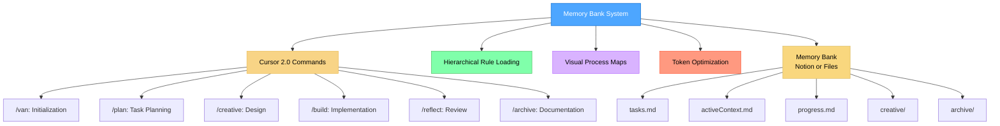
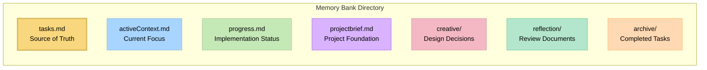

# Memory Bank System v0.8

A token-optimized, hierarchical task management system that uses Cursor 2.0 commands for efficient development workflows. **This fork adds Notion as the Memory Bank backend** – tasks, plans, and context live in your Notion workspace.



> **Personal Note**: Memory Bank is my personal hobby project that I develop for my own use in coding projects. As this is a personal project, I don't maintain an issues tracker or actively collect feedback. However, if you're using these rules and encounter issues, one of the great advantages is that you can ask the Cursor AI directly to modify or update the rules to better suit your specific workflow. The system is designed to be adaptable by the AI, allowing you to customize it for your own needs without requiring external support.

## About Memory Bank

Memory Bank is a structured development workflow system that uses Cursor 2.0 commands to guide you through different phases of the development process. It uses a hierarchical rule loading architecture that loads only the rules needed for each phase, optimizing token usage and providing tailored guidance.

### How It Works

Version 0.8 moves from cursor custom modes to cursor commands.  Memory Bank operates through **six specialized commands** that work together as an integrated workflow:

1. **`/van`** - Initializes projects, detects platform, determines task complexity
2. **`/plan`** - Creates detailed implementation plans based on complexity level
3. **`/creative`** - Explores design options for components requiring design decisions
4. **`/build`** - Systematically implements planned changes
5. **`/reflect`** - Reviews completed work and documents lessons learned
6. **`/archive`** - Creates comprehensive documentation and updates Memory Bank

Each command reads from and updates a shared **Memory Bank** – either Notion pages (this fork) or local `memory-bank/` files – maintaining persistent context across the entire workflow.

### Token-Optimized Architecture

Version 0.7 introduced significant token optimization improvements:

- **Hierarchical Rule Loading**: Only loads essential rules initially with specialized lazy-loading (~70% token reduction)
- **Progressive Documentation**: Implements concise templates that scale with task complexity
- **Optimized Command Transitions**: Preserves critical context efficiently between commands
- **Level-Specific Workflows**: Adapts documentation requirements to task complexity (Levels 1-4)
- **Lazy-Loaded Specialized Rules**: Loads specialized rules only when needed (e.g., architecture vs UI/UX design)

See the [Memory Bank Optimizations](MEMORY_BANK_OPTIMIZATIONS.md) document for detailed information about all optimization approaches.

### Command-Based Workflow System

Memory Bank transforms development into a structured, phase-based process:

- **Graph-Based Command Integration**: Commands are interconnected nodes in a development workflow
- **Workflow Progression**: Commands transition from one to another in a logical sequence (`/van` → `/plan` → `/creative` → `/build` → `/reflect` → `/archive`)
- **Shared Memory**: Persistent state maintained across command transitions via Memory Bank (Notion or files)
- **Adaptive Behavior**: Each command adjusts its recommendations based on project complexity level
- **Progressive Rule Loading**: Commands load only necessary rules, reducing context window usage

This approach transforms development from ad-hoc coding into a coordinated system with specialized phases working together.

### CREATIVE Command and Claude's "Think" Tool

The `/creative` command is conceptually based on Anthropic's Claude "Think" tool methodology, as described in their [engineering blog](https://www.anthropic.com/engineering/claude-think-tool). Version 0.8 implements an optimized version with:

- Progressive documentation with tabular option comparison
- "Detail-on-demand" approach that preserves token efficiency
- Structured templates that scale with complexity level
- Efficient context preservation for implementation phases

For a detailed explanation of how Memory Bank implements these principles, see the [CREATIVE Mode and Claude's "Think" Tool](creative_mode_think_tool.md) document.

## Key Features

- **Cursor 2.0 Commands**: Native integration with Cursor's commands feature - no setup required
- **Hierarchical Rule Loading**: Load only the essential rules with specialized lazy-loading
- **Progressive Documentation**: Concise templates that scale with task complexity
- **Unified Context Transfer**: Efficient context preservation between commands via Memory Bank
- **Command-Specific Visual Maps**: Clear visual representations for each development phase
- **Level-Specific Workflows**: Adapted processes based on complexity (Levels 1-4)
- **Platform-Aware Commands**: Automatically adapts commands to your operating system
- **Memory Bank Integration**: All commands read from and update shared Memory Bank (Notion or files)
- **Notion Backend**: Tasks, plans, and context in your Notion workspace

## Notion Integration

**This fork uses Notion as the default Memory Bank backend.** All operations use Notion MCP (`notion-fetch`, `notion-update-page`, `notion-create-pages`).

**Setup:** Copy `.cursor/notion-memory-bank.json.example` to `.cursor/notion-memory-bank.json`, then configure your `projectId`, `taskId`, and data source URLs. See **[NOTION_SETUP.md](NOTION_SETUP.md)** for details.

### Notion Backend

The Notion backend stores Memory Bank data in your Notion workspace:

- **Projects database** – Holds project pages (brief, active context, progress subpages)
- **Tasks database** – Holds task pages (plan, checklist, creative/reflection/archive subpages)
- **Relation** – Tasks link to Projects via a bidirectional relation

**Identifier convention:** `PROJECT-123` and `TASK-588` are resolved via `notion-search` against the respective databases. Add an `ID` property to your databases for reliable lookup.

**Config keys** (in `.cursor/notion-memory-bank.json`):
- `projectId`, `taskId` – Current project and task
- `projectsDataSourceUrl`, `tasksDataSourceUrl` – Database collection URLs
- `activeContextPageId`, `progressPageId` – Optional subpage IDs under Project
- `creativePageId`, `reflectionPageId`, `archivePageId` – Optional subpage IDs under Task

**Create a new task:** Use `/create-task <title>` to add a task to the Tasks database and associate it with the current project. The command returns the new `TASK-ID` and can update `taskId` in config.

## Installation Instructions

### Prerequisites

- **Cursor Editor**: Version 2.0 or higher (commands feature)
- **Notion MCP**: Required for this fork – install and configure `plugin-notion-workspace-notion`
- **AI Model**: Claude 4 Sonnet or Claude 4 Opus recommended, especially for `/creative`

### Step 1: Get the Files

Clone this repository into your project directory:

```bash
git clone https://github.com/xianzhu21/cursor-memory-notion.git
```

*Based on [vanzan01/cursor-memory-bank](https://github.com/vanzan01/cursor-memory-bank) with Notion integration.*

#### Alternative (Manual)

After extracting it from the ZIP file:

- Copy the `.cursor` folder to your project directory (contains both rules and commands)
- The `custom_modes` folder is kept for reference but not required

**Note**: Other documents are not necessary for Memory Bank operation - they are explanatory documents. You can copy them to a folder like `memory_bank_documents` if desired.

### Step 2: Configure Notion (Required for this fork)

```bash
cp .cursor/notion-memory-bank.json.example .cursor/notion-memory-bank.json
```

Edit `.cursor/notion-memory-bank.json` with your Notion project/task IDs and data source URLs. See [NOTION_SETUP.md](NOTION_SETUP.md).

### Step 3: Using Commands

1. **Type `/` in the Cursor chat** to see available commands:
   - `/van` - Initialization & entry point
   - `/plan` - Task planning
   - `/creative` - Design decisions
   - `/build` - Code implementation
   - `/reflect` - Task reflection
   - `/archive` - Task archiving

2. **Start with `/van`** to initialize your project:
   ```
   /van Initialize project for adding user authentication feature
   ```

3. **Follow the workflow** - each command will guide you to the next step

See [`.cursor/commands/README.md`](.cursor/commands/README.md) for detailed command documentation.

## Basic Usage

### Quick Start

1. **Initialize with `/van`**:
   ```
   /van Add user authentication to the application
   ```
   - Analyzes your project structure
   - Determines task complexity (Level 1-4)
   - Creates Memory Bank structure if needed
   - Routes to appropriate next command

2. **Follow the Workflow Based on Complexity**:

   **Level 1 (Quick Bug Fix):**
   ```
   /van → /build → /reflect → /archive
   ```

   **Level 2 (Simple Enhancement):**
   ```
   /van → /plan → /build → /reflect → /archive
   ```

   **Level 3-4 (Feature/System):**
   ```
   /van → /plan → /creative → /build → /reflect → /archive
   ```

### Command Reference

*When using Notion, "tasks.md" and similar refer to Notion pages (Task page body, subpages). See [NOTION_SETUP.md](NOTION_SETUP.md).*

#### `/van` - Initialization & Entry Point
**Purpose:** Initialize Memory Bank, detect platform, determine task complexity, route to workflows.

**Usage:**
```
/van [task description]
```

**What it does:**
- Detects your operating system and adapts commands
- Verifies or creates Memory Bank (Notion pages or `memory-bank/`)
- Analyzes task requirements
- Determines complexity level (1-4)
- Updates Task page or `memory-bank/tasks.md`

**Next steps:**
- Level 1 → `/build`
- Level 2-4 → `/plan`

#### `/plan` - Task Planning
**Purpose:** Create detailed implementation plans based on complexity level.

**Usage:**
```
/plan
```

**What it does:**
- Reads task requirements from Task page or `memory-bank/tasks.md`
- Reviews codebase structure
- Creates implementation plan (complexity-appropriate)
- Performs technology validation (Level 2-4)
- Identifies components requiring creative phases
- Updates `memory-bank/tasks.md` with complete plan

**Next steps:**
- Creative phases identified → `/creative`
- No creative phases → `/build`

#### `/creative` - Design Decisions
**Purpose:** Perform structured design exploration for flagged components.

**Usage:**
```
/creative
```

**What it does:**
- Reads components flagged for creative work from Task page or `memory-bank/tasks.md`
- For each component, explores multiple design options
- Analyzes pros/cons of each approach
- Selects and documents recommended approach
- Creates `memory-bank/creative/creative-[feature_name].md` documents
- Updates `memory-bank/tasks.md` with design decisions

**Next steps:**
- After all creative phases complete → `/build`

#### `/build` - Code Implementation
**Purpose:** Implement planned changes following the plan and creative decisions.

**Usage:**
```
/build
```

**What it does:**
- Reads implementation plan from Task page or `memory-bank/tasks.md`
- Reads creative phase documents (Level 3-4)
- Implements changes systematically
- Tests implementation
- Documents commands executed and results
- Updates `memory-bank/tasks.md` and `memory-bank/progress.md`

**Next steps:**
- After implementation complete → `/reflect`

#### `/reflect` - Task Reflection
**Purpose:** Facilitate structured reflection on completed implementation.

**Usage:**
```
/reflect
```

**What it does:**
- Reviews completed implementation
- Compares against original plan
- Documents what went well
- Documents challenges encountered
- Documents lessons learned
- Documents process and technical improvements
- Creates `memory-bank/reflection/reflection-[task_id].md`
- Updates `memory-bank/tasks.md` with reflection status

**Next steps:**
- After reflection complete → `/archive`

#### `/archive` - Task Archiving
**Purpose:** Create comprehensive archive documentation and update Memory Bank.

**Usage:**
```
/archive
```

**What it does:**
- Reads reflection document and task details
- Creates comprehensive archive document
- Archives creative phase documents (Level 3-4)
- Updates `memory-bank/tasks.md` marking task COMPLETE
- Updates `memory-bank/progress.md` with archive reference
- Resets `memory-bank/activeContext.md` for next task
- Creates `memory-bank/archive/archive-[task_id].md`

**Next steps:**
- After archiving complete → `/van` (for next task)

### Example Workflow

Here's a complete example workflow for a Level 3 feature:

```bash
# Step 1: Initialize
/van Add user authentication with OAuth2 support

# Step 2: Plan (VAN routes to PLAN for Level 3)
/plan

# Step 3: Explore design options for OAuth integration
/creative

# Step 4: Implement the feature
/build

# Step 5: Reflect on the implementation
/reflect

# Step 6: Archive the completed task
/archive
```

## Memory Bank Structure

**Notion (this fork):** Task page body, Project brief, and subpages (Active Context, Progress, Creative, Reflection, Archive) under your Notion Project/Task. See [NOTION_SETUP.md](NOTION_SETUP.md) for mapping.

All Memory Bank files are stored in the `memory-bank/` directory (file-based mode):



### Core Files

- **`tasks.md`**: Central source of truth for task tracking, checklists, and component lists
- **`activeContext.md`**: Maintains focus of current development phase
- **`progress.md`**: Tracks implementation status and observations
- **`projectbrief.md`**: Project foundation and context
- **`productContext.md`**: Product-specific context and requirements
- **`systemPatterns.md`**: System patterns and architectural decisions
- **`techContext.md`**: Technical context and technology stack

### Generated Files

- **`creative/creative-[feature_name].md`**: Design decision documents (Level 3-4)
- **`reflection/reflection-[task_id].md`**: Reflection documents
- **`archive/archive-[task_id].md`**: Archive documents for completed tasks

## Progressive Rule Loading

Each command implements progressive rule loading to optimize context usage:

1. **Core Rules** - Always loaded first
   - `main.mdc` - System foundation
   - `memory-bank-paths.mdc` - Notion / file path definitions
   - `notion-verification.mdc` - Notion structure verification (when using Notion)

2. **Command-Specific Rules** - Loaded based on command
   - Visual process maps (e.g., `van-mode-map.mdc`)
   - Command-specific workflows

3. **Complexity-Specific Rules** - Loaded based on task complexity
   - Level 1: `workflow-level1.mdc`
   - Level 2: `workflow-level2.mdc`, `task-tracking-basic.mdc`
   - Level 3: `workflow-level3.mdc`, `planning-comprehensive.mdc`
   - Level 4: `workflow-level4.mdc`, `architectural-planning.mdc`

4. **Specialized Rules** - Lazy loaded only when needed
   - Creative phase types (architecture, UI/UX, algorithm)
   - Advanced verification rules
   - Platform-specific adaptations

This approach reduces initial token usage by **~70%** compared to loading all rules at once.

## Complexity Levels

Memory Bank adapts its workflow based on task complexity:

### Level 1: Quick Bug Fix
- **Workflow**: `/van` → `/build` → `/reflect` → `/archive`
- **Characteristics**: Single file changes, targeted fixes
- **Documentation**: Minimal, focused on the fix

### Level 2: Simple Enhancement
- **Workflow**: `/van` → `/plan` → `/build` → `/reflect` → `/archive`
- **Characteristics**: Multiple files, clear requirements
- **Documentation**: Basic plan, implementation steps

### Level 3: Intermediate Feature
- **Workflow**: `/van` → `/plan` → `/creative` → `/build` → `/reflect` → `/archive`
- **Characteristics**: New components, design decisions needed
- **Documentation**: Comprehensive plan, creative phases, detailed reflection

### Level 4: Complex System
- **Workflow**: `/van` → `/plan` → `/creative` → `/build` → `/reflect` → `/archive`
- **Characteristics**: Multiple subsystems, architectural decisions
- **Documentation**: Phased implementation, architectural diagrams, comprehensive archive

## Troubleshooting

### Commands Not Appearing

- **Verify Cursor version**: Ensure you're using Cursor 2.0 or higher
- **Check file location**: Ensure `.cursor/commands/` directory exists in project root
- **Restart Cursor**: Sometimes a restart is needed to detect new commands

### Command Not Working Correctly

- **Notion**: Verify `.cursor/notion-memory-bank.json` exists and has valid `projectId`, `taskId`, data source URLs. Run `/van` to create missing subpages.
- **File-based**: Verify `memory-bank/` directory exists
- **Verify task status**: Check Task page or `memory-bank/tasks.md` for current task state
- **Review command order**: Ensure you're following the correct workflow sequence
- **Check rules**: Verify `.cursor/rules/isolation_rules/` directory exists

### Rules Not Loading

- **Verify file paths**: Ensure rule files are in `.cursor/rules/isolation_rules/`
- **Check file permissions**: Verify files are readable
- **Review command logs**: Check what rules the command is trying to load

### Memory Bank Issues

- **Notion**: Run `/van` to create missing activeContext/Progress subpages. Check `notion-memory-bank.json` for correct IDs.
- **File-based**: Run `/van` to initialize Memory Bank structure
- **Corrupted state**: Check Task page or `memory-bank/tasks.md` for task status
- **File conflicts**: Review recent changes to Memory Bank files

## Legacy Custom Modes (Deprecated)

> **Note**: Custom modes are deprecated in favor of Cursor 2.0 commands. If you're using Cursor 2.0+, please use commands instead. Custom modes setup instructions are available in the `custom_modes/` directory for reference only.

If you're using an older version of Cursor that doesn't support commands, see the [Commands Migration Guide](COMMANDS_MIGRATION.md) for information about the legacy custom modes setup.

## Version Information

This is version v0.8 of the Memory Bank system. It introduces significant token optimization improvements over v0.7-beta while maintaining all functionality. See the [Release Notes](RELEASE_NOTES.md) for detailed information about the changes.

### Ongoing Development

The Memory Bank system is actively being developed and improved. Key points to understand:

- **Work in Progress**: This is a beta version with ongoing development. Expect regular updates, optimizations, and new features.
- **Feature Optimization**: The modular architecture enables continuous refinement without breaking existing functionality.
- **Previous Version Available**: If you prefer the stability of the previous version (v0.1-legacy), you can continue using it while this version matures.
- **Architectural Benefits**: Before deciding which version to use, please read the [Memory Bank Upgrade Guide](memory_bank_upgrade_guide.md) to understand the significant benefits of the new architecture.

## Resources

- [NOTION_SETUP.md](NOTION_SETUP.md) - Notion configuration and mapping
- [Commands Documentation](.cursor/commands/README.md) - Detailed command usage guide
- [Commands Migration Guide](COMMANDS_MIGRATION.md) - Migration from custom modes to commands
- [Memory Bank Optimizations](MEMORY_BANK_OPTIMIZATIONS.md) - Detailed overview of token efficiency improvements
- [Release Notes](RELEASE_NOTES.md) - Information about the latest changes
- [Memory Bank Upgrade Guide](memory_bank_upgrade_guide.md) - Understanding the new architecture
- [CREATIVE Mode and Claude's "Think" Tool](creative_mode_think_tool.md) - Design methodology explanation

## Contributing

As mentioned in the personal note above, Memory Bank is a personal project. However, if you find it useful and want to adapt it for your own needs, you can:

1. **Ask Cursor AI**: Modify the rules and commands directly using Cursor AI
2. **Fork and Customize**: Clone the repository and adapt it to your workflow
3. **Share Improvements**: If you make useful improvements, consider sharing them with the community

---

*Note: This README is for v0.8 and subject to change as the system evolves.*
